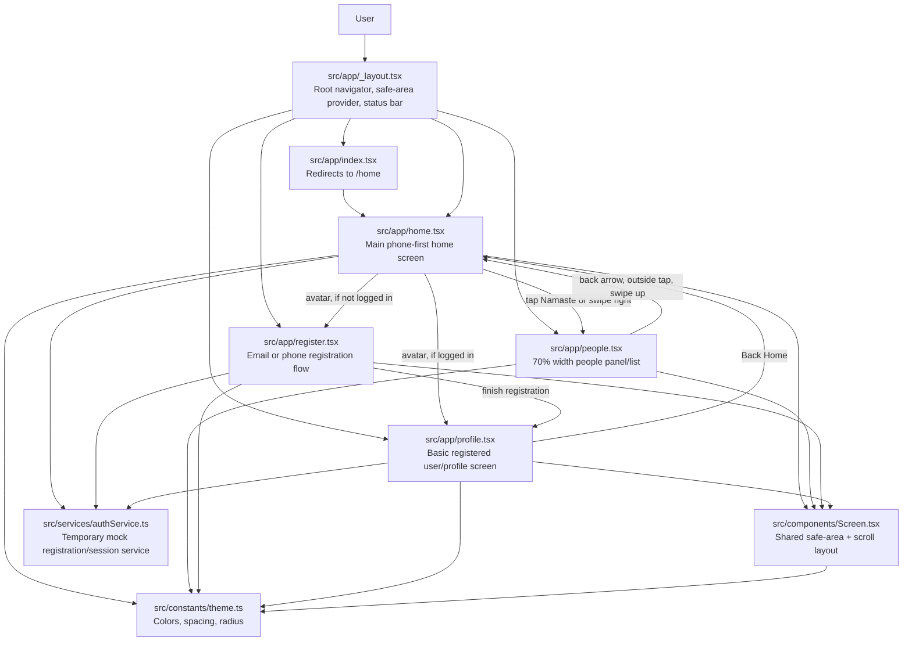
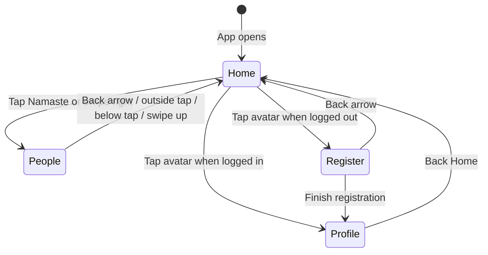
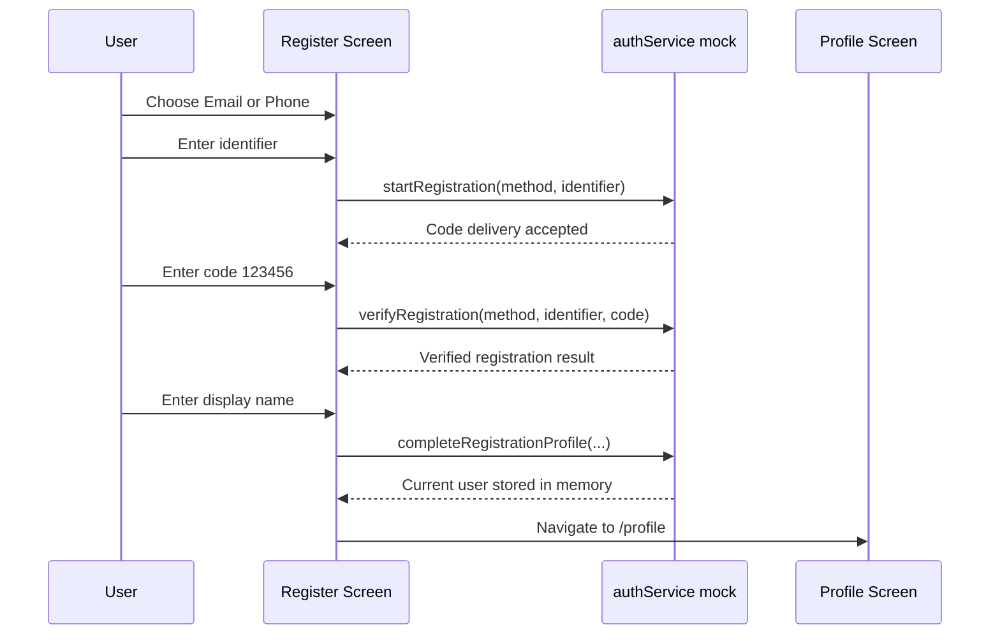

# Frontend Application Structure

This document describes the current frontend structure for the Namaste mobile-first app. The app is built with Expo, React Native, and Expo Router. The phone app is the primary target; web support is secondary and can stay limited.

## High-Level Shape

The app uses file-based routing from Expo Router. Each file in `src/app` becomes a screen route. Shared visual shell, theme values, and temporary auth logic live outside the route files so screens can reuse them.



## Folder Structure

```text
frontend/
  src/
    app/
      _layout.tsx       Root layout and navigation stack setup.
      index.tsx         Default route; redirects users to /home.
      home.tsx          Main app screen and primary phone-first entry point.
      people.tsx        People list panel opened from Home.
      register.tsx      Register with email or phone, verify code, set display name.
      profile.tsx       Basic profile/account screen after registration.
    components/
      Screen.tsx        Shared safe-area and scroll container.
    constants/
      theme.ts          Shared design tokens.
    services/
      authService.ts    Temporary local mock auth/registration service.
```

## Page Responsibilities

| Page | Route | Main responsibility | Connected to |
| --- | --- | --- | --- |
| `index.tsx` | `/` | Sends users to the Home screen. | Redirects to `/home`. |
| `home.tsx` | `/home` | Main entry screen. Shows Namaste, city/country, avatar/register entry, and phone-first app direction. | Opens `/people`, `/register`, or `/profile`. |
| `people.tsx` | `/people` | Shows a left-side 70% width people list panel. | Returns to `/home` by back arrow, outside tap, below-panel tap, or upward swipe. |
| `register.tsx` | `/register` | Allows first-time registration using email or phone without a password. Uses a development verification code. | Completes into `/profile`; can go back to `/home`. |
| `profile.tsx` | `/profile` | Displays the current registered user from the mock auth service. | Goes back to `/home`. |

## Shared Pieces

### `Screen.tsx`

`Screen` wraps app pages with:

- safe-area handling for iOS and Android;
- app background color;
- default scrolling behavior;
- a mobile-sized max width only on web;
- common page padding and spacing.

Screens can pass `scroll={false}` when they need full-screen gesture/layout control, as the People page does.

### `theme.ts`

`theme.ts` centralizes app design values:

- `colors` for background, text, border, primary, success, and danger states;
- `spacing` for consistent gaps and padding;
- `radius` for rounded UI elements.

### `authService.ts`

`authService.ts` is currently a frontend-only mock. It provides:

- email or phone normalization;
- email and phone validation;
- start registration;
- verify code using development code `123456`;
- complete profile with display name;
- return current in-memory user.

This should later be replaced by real backend calls to the Spring Boot API.

## Current Navigation Flow



## Registration Flow



## Mobile-First Notes

- Home is the primary app entry point.
- People behaves like a phone-oriented side panel instead of a desktop page.
- Web preview is intentionally secondary.
- Native behavior should not be compromised to make web smoother.
- Future backend integration should keep long sessions on the device until the user logs out.

## Future Backend Connection

When Spring Boot is added, `authService.ts` can become the boundary between the app and backend APIs:

- `startRegistration` calls an endpoint that sends an OTP to email or phone.
- `verifyRegistration` calls an endpoint that validates the OTP and creates or resumes a session.
- `completeRegistrationProfile` saves basic profile fields.
- `getCurrentUser` reads a persisted session/user record instead of in-memory state.

This keeps the screens mostly stable while replacing the mock implementation underneath.
