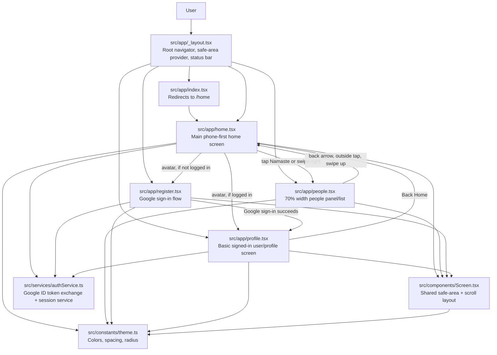
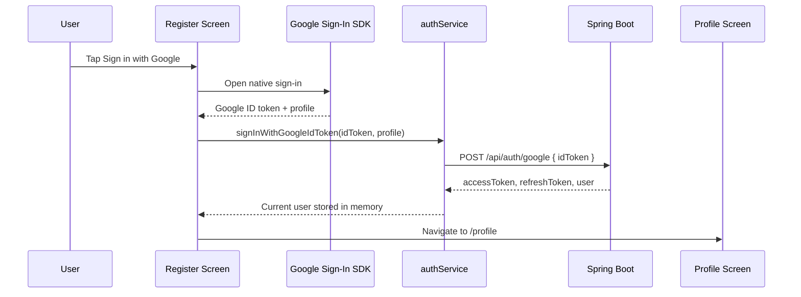

# Frontend Application Structure

This document describes the current frontend structure for the Namaste mobile-first app. The app is built with Expo, React Native, and Expo Router. The phone app is the primary target; web support is secondary and can stay limited.

## High-Level Shape

The app uses file-based routing from Expo Router. Each file in `src/app` becomes a screen route. Shared visual shell, theme values, and auth API boundary logic live outside the route files so screens can reuse them.



## Folder Structure

```text
frontend/
  src/
    app/
      _layout.tsx       Root layout and navigation stack setup.
      index.tsx         Default route; redirects users to /home.
      home.tsx          Main app screen and primary phone-first entry point.
      people.tsx        People list panel opened from Home.
      register.tsx      Sign in with Google and exchange the ID token with Spring Boot.
      profile.tsx       Basic profile/account screen after sign-in.
    components/
      Screen.tsx        Shared safe-area and scroll container.
    constants/
      theme.ts          Shared design tokens.
    services/
      authService.ts    Google token exchange and in-memory user/session service.
```

## Page Responsibilities

| Page | Route | Main responsibility | Connected to |
| --- | --- | --- | --- |
| `index.tsx` | `/` | Sends users to the Home screen. | Redirects to `/home`. |
| `home.tsx` | `/home` | Main entry screen. Shows Namaste, city/country, avatar/register entry, and phone-first app direction. | Opens `/people`, `/register`, or `/profile`. |
| `people.tsx` | `/people` | Shows a left-side 70% width people list panel. | Returns to `/home` by back arrow, outside tap, below-panel tap, or upward swipe. |
| `register.tsx` | `/register` | Opens the native Google Sign-In SDK, receives a Google ID token, and sends it to Spring Boot for app tokens. | Completes into `/profile`; can go back to `/home`. |
| `profile.tsx` | `/profile` | Displays the current signed-in user from the auth service. | Goes back to `/home`. |

## Shared Pieces

### `Screen.tsx`

`Screen` wraps app pages with:

- safe-area handling for iOS and Android;
- app background color;
- default scrolling behavior;
- a mobile-sized max width only on web;
- common page padding and spacing.

Screens can pass `scroll={false}` when they need full-screen gesture/layout control, as the People page does.

### `theme.ts`

`theme.ts` centralizes app design values:

- `colors` for background, text, border, primary, success, and danger states;
- `spacing` for consistent gaps and padding;
- `radius` for rounded UI elements.

### `authService.ts`

`authService.ts` is the frontend auth boundary. It provides:

- Google ID token exchange with Spring Boot;
- storage of the returned app `accessToken` and `refreshToken` for the current session;
- access to the current in-memory user;
- access-token lookup for future authenticated API calls.

## Current Navigation Flow

```mermaid
stateDiagram-v2
  [*] --> Home: App opens
  Home --> People: Tap Namaste or swipe right
  People --> Home: Back arrow / outside tap / below tap / swipe up
  Home --> Register: Tap avatar when logged out
  Home --> Profile: Tap avatar when logged in
  Register --> Profile: Google sign-in succeeds
  Register --> Home: Back arrow
  Profile --> Home: Back Home
```



## Google Sign-In Flow



## Mobile-First Notes

- Home is the primary app entry point.
- People behaves like a phone-oriented side panel instead of a desktop page.
- Web preview is intentionally secondary.
- Native behavior should not be compromised to make web smoother.
- Backend integration should keep long sessions on the device until the user logs out.

## Backend Contract

The mobile app expects Spring Boot to expose a Google token exchange endpoint:

- URL: `EXPO_PUBLIC_API_BASE_URL` + `EXPO_PUBLIC_GOOGLE_AUTH_PATH`, defaulting to `http://localhost:8080/api/auth/google`.
- Request body: `{ "idToken": "..." }`.
- Response body: `{ "accessToken": "...", "refreshToken": "...", "user": { "userId": "...", "displayName": "...", "email": "..." } }`.

Spring Boot should verify the Google ID token with Google, create or find the user in the database, and return Namaste app tokens.
